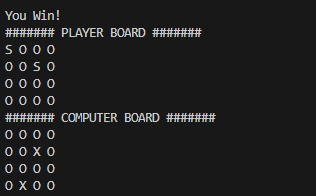
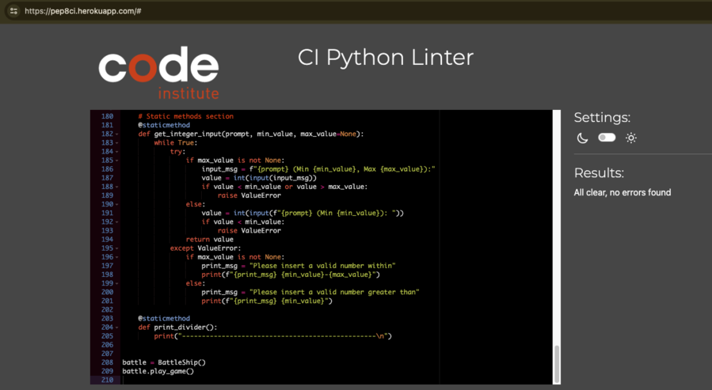

# Battleship Game

Written by Dyeneffer Dias 

This Battleship game is in Python designed for the Code Institute mock terminal on Heroku.


## How to play

The goal of this game is to sink the opponent's ships that is hidden. 

Players can customise the grid size and decide the number of ships they'd like to have and add their username. 

The player has to guess where the opponent's ships are by choosing a row and a column each turn (using numbers only). 

So does the computer to sink the player's ships. 

When the player inputs a letter instead of a number, a message will display, instructing them to "please enter a valid number."

If the player inputs coordinates that are outside the grid, a message will pop up to advise the player: "Please enter valid coordinates."

The board consists of "O" symbols, which represent slots that might either contain the enemy's hidden ship or be empty spaces. 

When the player discovers the opponent's ships, a message pops up, indicating "You've sunk the opponent's ship." If they miss, a message reads "You missed!"

If the computer locates one of the player's ships, a message displays: "Computer found one of your ships!" Otherwise, it shows "Computer missed!"

At the game's conclusion, if either the player or the computer manages to sink all ships, a message declares "You win" or "You lose," along with the final score.

After either achieving victory or defeat, the program asks whether the player wishes to play again, allowing them to input "yes" or "no." Opting for "yes" initiates a new game, while selecting "no" triggers a message that reads "Thanks for playing," followed by the program's closure.

## Logic of the game

In the game, the goal is to discover the computer's ships on its board while the computer aims to locate and sink the player's ships on the player's board.

Throughout the game, the player can't view the computer's board, only the "O" symbols. Only at the very end can the player see the computer's board.

The "X" stands for a ship that the player has successfully sunk from the computer. "S" represents the player's ships that are still remaining. 



To avoid the player from selecting the same coordinates, they will be able to view their previous guesses on the opponent's boards. 


## Features
### Existing Features
- Play against the computer 
- Accept user input
- Player can select board size and number of ships
- Show score and player's name
- Must enter numbers only
- Player cannot see where the computer's ships are


### Future Features
- Introduce ships with varying sizes, introducing different levels of difficulty.

- Enforce a constraint on the number of ships entered to ensure they fit within the board dimensions.

- Include an option for multiplayer, allowing interaction with another player instead of solely engaging with the computer.

- Allow player to position ships themselves

## Data Model 
The core of my game structure is the "BattleShip" class, encompassing essential attributes required for the game to function. These include details like the size of the game board (Field_Size), the quantity of ships (Ships_Qt), the player's game board (Player_Board), the computer's game board (PC_Board), the displayed version of the computer's board (PC_Board_Display), the user's username (User_Name), the user's score (User_Score), and the computer's score (PC_Score).

```python
def initialize_properties(self):
        self.Field_Size = ''
        self.Ships_Qt = ''
        self.Player_Board = []
        self.PC_Board = []
        self.PC_Board_Display = []
        self.User_Name = ''
        self.User_Score = 0
        self.PC_Score = 0
```
## Testing 
I have manually tested this project by doing the following
- Passed the code through a PEP8 Python Validator and no errors were returned



- Tested in my local terminal and the Code Institute Heroku terminal

### Bugs and Challenge

Solved bugs:
- In the past, I didn't provide a warning when players included letters in their input, resulting in errors. Now, I've introduced a feature to notify players to input only numbers and prevent such errors.

Remaining bugs:
- player can enter the same guess twice
- Include a greater number of ships than the board can hold.


## Deployment
This project was deployed using Code Institute's mock terminal for Heroku
- Steps for deployment:
Clone the repository 
Create Heroku account 
Set buildbacks to python and NodeJS in that order
Link Heroku account to the repository
Click on Deploy


## Credits 
- Code Institute for READ.ME file 
- Code Institute for deployment terminal 
